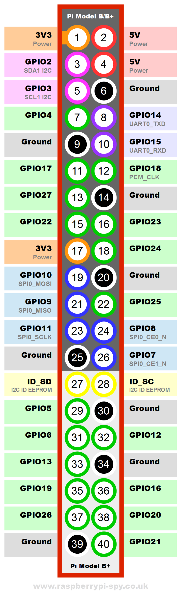

# Overview

- Introduce Raspberry PI Printable resources
- The GPIO Reference - printout
- Terminal command - printout
- Pi Images with GPIO Pins
- Loops - For and While

## GPIO Reference




## Raspberry PI Pin Identification

### PI 3


### Raspberry PI 4


### Raspberry PI Zero


## GPIO Reference Commands

```bash
# Open Terminal
# Display your raspberry pi pin details
pinout

```

```python

# Open Python editor
import RPi.GPIO as GPIO

# Use Broadcom pin numbers (GPIO 14, GPIO 15 etc)
GPIO.setmode(GPIO.BCM)

# Use board pin numbers (4,5, 8 etc)
GPIO.setmode(GPIO.BOARD)

# Set up the pin at [pin number] to be an input
GPIO.setup([pin number], GPIO.IN)

# Set up the pin at [pin number] to be an output
GPIO.setup([pin number], GPIO.OUT)

# Set [pin number]'s value (1 = true = GPIO.HIGH)
GPIO.output([pin number], 1)
GPIO.output([pin number], True)
GPIO.output([pin number], GPIO.HIGH)

# Set [pin number]'s value (0 = False =  GPIO.LOW)
GPIO.output([pin number], 0)
GPIO.output([pin number], False)
GPIO.output([pin number], GPIO.LOW)

# Reset all GPIO pins
# Good practice to call before leaving any program
GPIO.cleanup()

# Returns current RPi.GPIO version
GPIO.VERSION

```

## For loops

```python

# For loop with default count from 1 to 10.
for i in range(1,10):
  print(i)

# For loop with custom counting from 10 to -10 backwards by 1
for i in range(10,-10,-1):
  print(i)

# For loop over a list element
for i in myList:
  print(i)
```

## While loops

```python

# While less than
while (x < y):
  x += 1
  x = x +1
  print (x)

# While true with break
while (true):
  x +=1
  print (x)
  if (x > y):
    break

```

## References

- Raspberry PI Images sourced from https://commons.wikimedia.org/
- Raspberry PI Commands based on the work by Ian Buckley  https://www.makeuseof.com/tag/raspberry-pi-commands-cheat-sheet/

[Raspberry PI GPIO Pin Printout](../assets/Raspberry-Pi-GPIO-Layout-Worksheet.pdf)

[Raspberry PI Commands Printout](../assets/Raspberry-PI-Cheat-Sheet.docx)

[Python Documentation - Loops](https://docs.python.org/3/tutorial/controlflow.html)

[Learn loops](https://www.learnpython.org/en/Loops)
