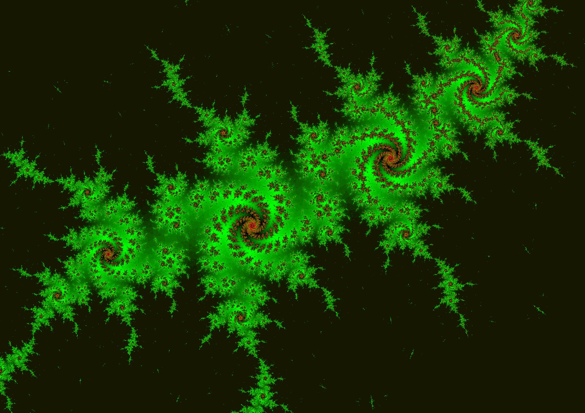

# Overview

- Introduce Raspberry PI Printable resources
- The GPIO Reference - printout
- Terminal command - printout
- Modular programming with functions

## Modular programming

> A modular design can be characterized by functional partitioning into discrete scalable and reusable modules, rigorous use of well-defined modular interfaces, and making use of industry standards for interfaces.

[Source: Wikipedia](https://en.wikipedia.org/wiki/Modular_design)

Software applications are logical processes that run. As you write more and more software programs you will start to notice patterns of code repeating.  Pattern matching is a key skill to acquire, so you can re-use previous code in you new routines. This is more creative, subjective part of your craftsmanship

- Jigsaw Puzzles
- Music composer
- Fractals




Terminology you may hear and see

- Don't repeat yourself (DRY)
- Separation of concerns
- Plugins
- Snippets

## Modular programming in Python

```python
#Sing a birthday tune.
def happyBirthday(name):
    print("Happy Birthday to you!")
    print("Happy Birthday to you!")
    print(f"Happy Birthday, dear {name}")
    print("Happy Birthday to you!")
    print()

happyBirthday("Hubert")
happyBirthday("Garth")

```

## Exercise - Christmas light show

In preparation for christmas, we need to put on a light display for the family.

Tools

- 1 or more Led Light(s)
- 1 or more Buttons
- Raspberry Pi

Objective

- Make the button do different things with the led light.
  - E.g. Faster, slower, random blinking for 10 seconds.
- Press the button multiple times, to show different light display patterns.
