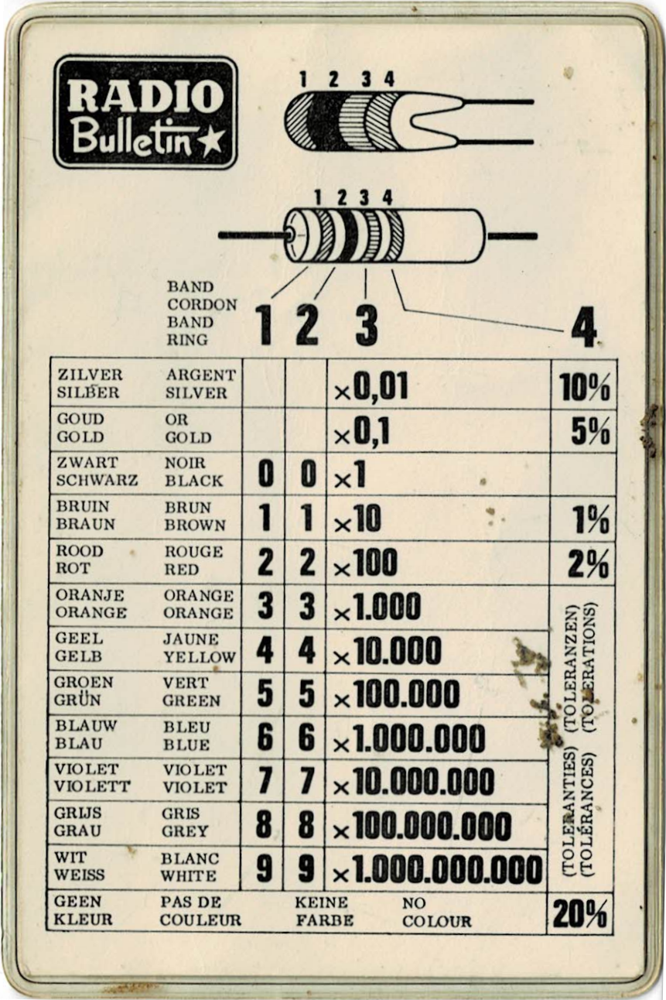
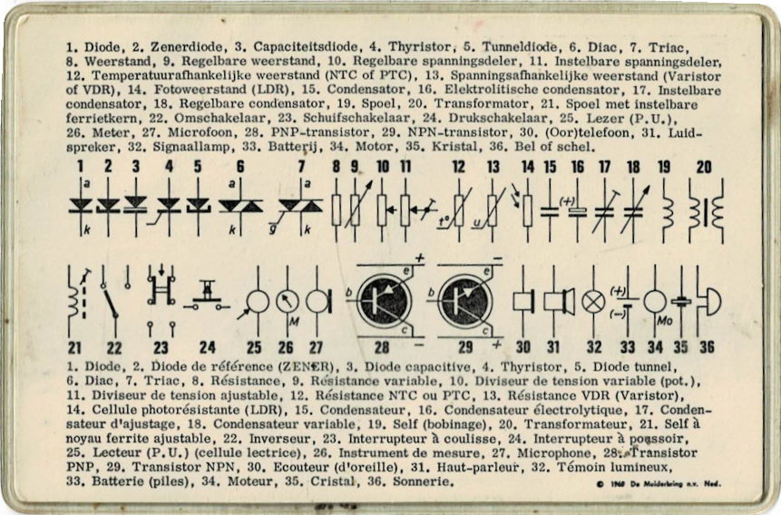

# Electronics Interest group

The [Centenary Mens Shed](http://www.csms.org.au/) electronics interest group resources.

| Theory Topic                  | Description              |
|------------------------|--------------------------|
| [Introduction](Week%201%20Introduction.pdf) | Introduction to Electronics |
| [Basic Components](Week%202%20Basic%20Components.pdf) | Resistors, Capacitors and Inductors |

| Software Topic                  | Description              |
|------------------------|--------------------------|
| [Variables](Lesson1-Variables/Readme.md) | Introduction to raspberry pi and python software programing |
| [Counting](Lesson2-Counting/Readme.md) | Counting in python |

## Electronic Images

## References - Raspberry Pi

[Raspberry Pi Foundation](https://www.raspberrypi.org/)

[Raspberry Pi Device: 4B](https://www.raspberrypi.org/products/raspberry-pi-4-model-b/)

[Raspberry Pi Device: Zero (Small form factor)](https://www.raspberrypi.org/products/raspberry-pi-zero-w/)

[Commercialization considerations](https://www.hallsteninnovations.com/raspberry-pi-to-production/)

## Kit Suppliers

The following links are not endorsements, just a starting guide.

[Kits - Adeept](https://www.adeept.com/)

[Kits - KeyStudio](https://www.keyestudio.com/)

[Kits - Kumantech](http://www.kumantech.com/)

## Electronic Suppliers (Australia)

[RS Online](https://au.rs-online.com/)

[Element 14](https://au.element14.com/)

[Pi Australia](https://raspberry.piaustralia.com.au/)

[Core Electronics](https://core-electronics.com.au/)

[Little Bird](https://www.littlebird.com.au/)

## Other links

[Energy Monitoring](https://learn.openenergymonitor.org/)

[Current Sensor](https://core-electronics.com.au/non-invasive-ac-current-sensor-20a-max-seeed-studio.html)

[Sensor - Standoff, Risers - Plastic](https://au.banggood.com/180-PCS-M2-Nylon-Plastic-Screw-Screw-nutsInsulated-Column-Pillar-Set-For-FPV-RC-Drone-p-1314659.html?gmcCountry=AU&currency=AUD)

[HAT - Standoff Spacers - Brass](https://au.banggood.com/270Pcs-M2-SingleDouble-pass-Copper-Pillar-Round-Screw-Brass-Standoff-Spacer-Isolation-Column-p-1385646.html?gmcCountry=AU&currency=AUD)

[iBeacon - Apple](https://www.theregister.com/2013/11/29/feature_diy_apple_ibeacons/) or [Android Beacon](https://circuitdigest.com/microcontroller-projects/turn-your-raspberry-pi-into-bluetooth-beacon-using-eddystone-ble-beacon) or [Pi Beacon](https://pimylifeup.com/raspberry-pi-ibeacon/)

## Learning

[Mains - Relay Switch](https://www.youtube.com/watch?v=bOGltcgiXiU)