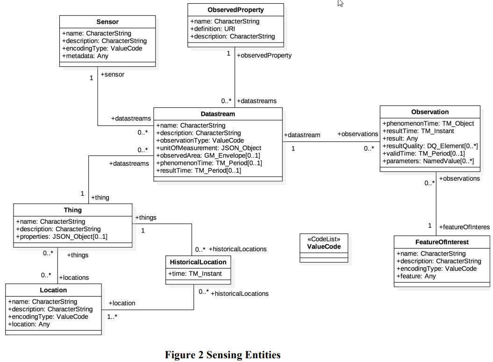

# Storing Sensor data

It will be important to collect and store sensor data. There are open source sensor API's and data structures that should be considered when collecting sensor data.

## References

Copyright © 2016 Open Geospatial Consortium

[Open Sensor Entities](../assets/15-078r6_OGC_SensorThings_API_Part_1_Sensing.pdf)

[OGC SensorThings API](https://github.com/opengeospatial/sensorthings)
